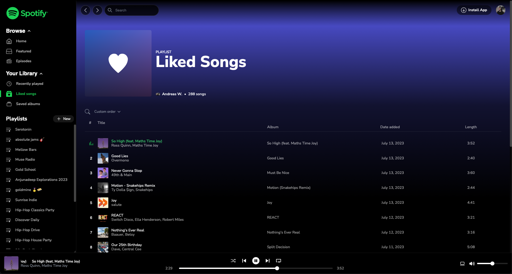

# Spotify Web Application - general information
## [Walkthrough of the Spotify Web Clone (1080p Screencapture on Vimeo)](https://vimeo.com/849970125)
The front-end is: 
- React 17 with Vite 
- React Router
- Zustand 
- TailwindCSS
- Deployed on Netlify Pages.

The Spotify authentication flow is: 
- A basic NodeJS application hosted as a Docker Image on Fly.io

> The [live application](https://spotty-web.netlify.app) does not work *for now*, because I do not have a public Spotify API Key (if you want to test the application yourself, send me a message with your Spotify email address - requires premium - and I can add you into the application dashboard).
More information below the images.

## How to run this on your machine 
> Disclaimer: In order for the deployed application to work for every visitor, you will need an extended API quota mode from Spotify (which I don't have either).
Therefore, if you want to run this application on your machine: 
- Clone this repo
- `pnpm install`
- `pnpm run dev` will point you to `localhost:5173`, unless the port is already in use.

Then, you will need:
- A Spotify Premium account
- Create an application in your [Spotify Dashboard](https://developer.spotify.com/dashboard) and get your **Client Secret** and **Client ID**
- Follow the [authorization code flow tutorial](https://developer.spotify.com/documentation/web-api/tutorials/code-flow) and implement your own tiny server.

After these steps, create an `.env.production.local` in the root of this application and add the `VITE_BE_URL=` pointing at **your own** server that is deployed somewhere (`pnpm run build` then `pnpm run preview`).
If you just want to use it in development mode, modify the `.env.development` so that `VITE_BE_URL=` points at your own localhost, then run `pnpm run dev`.

You can structure your tiny server that's handling the authentication flow however you want, but I had only three endpoints (`/login`, `/callback`, `/logout`).
As long as you follow and implement the authentication flow from Spotify properly and manage to generate your own access tokens, it should work.

